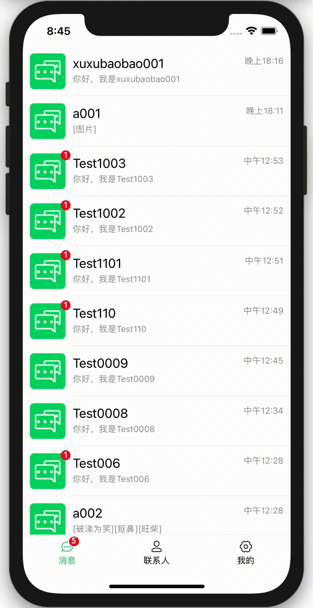

# vue-im
基于[vue2.0](https://cn.vuejs.org/)、[socket.io](https://socket.io/docs/v3)、[h5+ runtime](https://ask.dcloud.net.cn/docs/)的即时通讯App

## 安装工程
```
npm install
```
## 启动工程
```
npm run serve
```

## 线上预览地址（切换至手机模式下预览）
https://im.goldzy.top/


## 后端工程地址
[vue-im-server](https://github.com/hurongju/vue-im-server/)
## android测试包安装
https://im.goldzy.top/app-debug.apk

## 动图预览  

**聊天列表**  
<br/>
 
<br/>

**好友列表**
<br/>
 
<br/>

**聊天界面**
<br/>
  
<br/>

**添加好友**
<br/>
